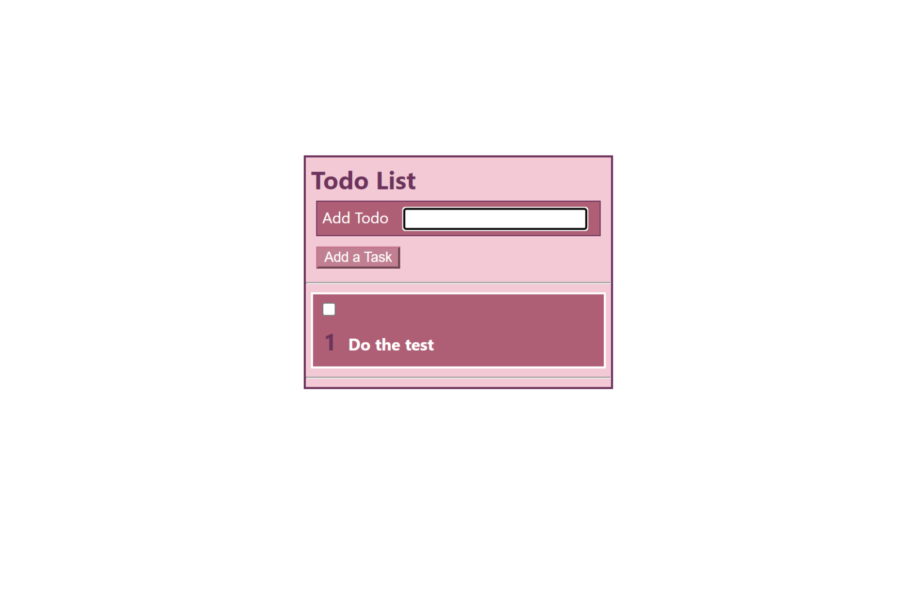

## React Test - Maha Abbas 
___
### The basic structure has been setup for a to-do list. This is what is left to do:
___
#### Finished Task Screenshot

___
#### Set up Instructions: 
- Finish setting up state for the text input
- Set state of list of tasks when submitting a new task
- Display list of tasks using the TaskCard component
- Add numbering of tasks to task cards
- Add ability to mark each task as "done" with a checkbox
- Update styling of the task when task is "done"
- Styling of your choice, e.g. strikethough on text, text color, background color
- Bonus: Add a checkbox that lets the user mark all the tasks "done" at once
